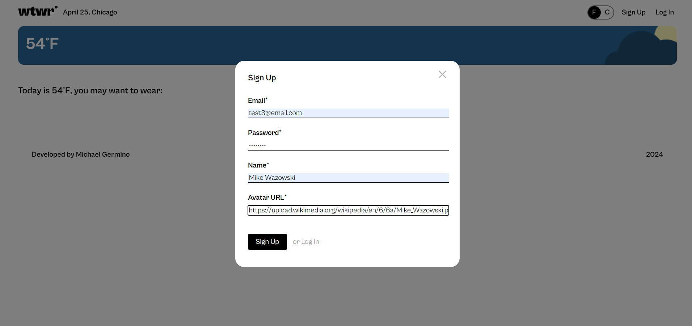
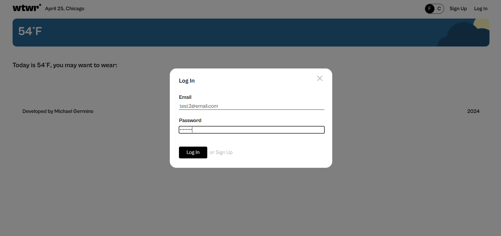
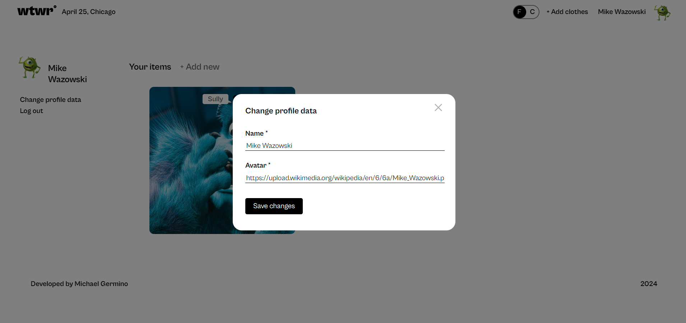
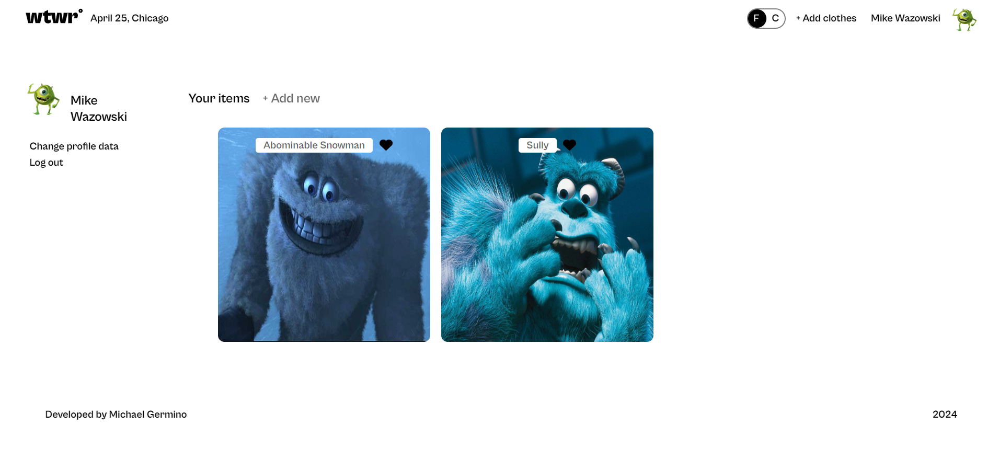
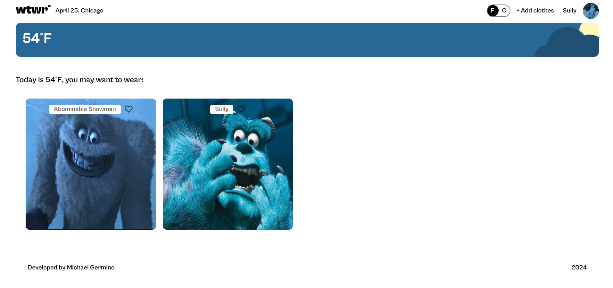

# Project 14: WTWR.

### Overview

- Intro
- Back-end Repo link
- Improve
- Website

**Intro**

This is the fourteenth project of the Software Engineer program at Practicum. It was created using HTML, CSS, and JavaScript and React.JS based on the Figma design. This project communicates with a back-end server by storing registration information, cards and tokens. Users who are not logged in will not be able to access the profile route with the use of protected routes. Users who are logged in will automatically be redirected to their profile. Within that page, they will only be able to have access to the cards that belong to them. The user's profile page filters out cards that do not belong to them while the home page shows all cards added to the server. Users who post a card into the database will have the option to delete their own card as well.

**Back-end Repo**

To connect to the back-end server, follow this link to clone the repo:

https://github.com/germino45/se_project_express

**Improve**

Currently, I am working on the functionality for filtering the Weather Card to change based on the weather at the time of day. This will come out with the next update. A future update will include a responsive design that will change based on the screen size of the user's device and an improved form validity.

**Website**

https://germino45.github.io/se_project_react/

**Pictures**

